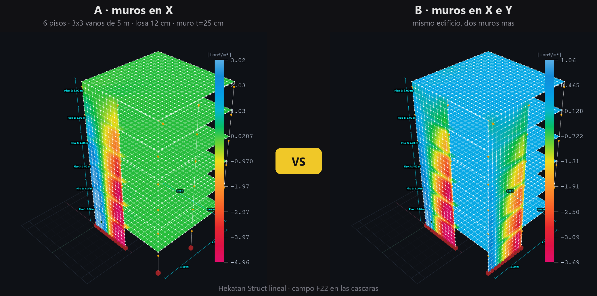

# Edificio con muros, A contra B: Hekatan Struct lineal, ETABS 22 y SAP2000 24

**Resultado (8-sep-2026)**: con la misma malla, Hekatan `comparar=0` = SAP2000 y Hekatan `comparar=1` = ETABS,
los dos a 0.0000 % en desplazamientos y reacciones, por OAPI y por fichero (`.s2k` y `.e2k` arreglado).



**El edificio**: `edificio-aporticado` de Hekatan Struct, 6 pisos de 3 m, 3×3 vanos de 5 m,
losa de 12 cm (placa, Thin), columnas y vigas de hormigón, sin diagonales. Cargas: 7 kN en
cada nudo de eje de columna por planta (Σ = 378 kN) y un empuje lateral de 50 kN.

| variante | muros de corte (t = 25 cm) | nudos | barras | cáscaras |
|---|---|---|---|---|
| **A** | en X (primer vano de las dos fachadas Y) | 3333 | 894 | 3120 |
| **B** | en X e Y (primer vano de las cuatro fachadas) | 3981 | 984 | 3840 |

Los tres programas resuelven **la misma malla nudo a nudo** (el `.e2k` y el `.s2k` salen del
mismo modelo con `cli/exportar_csi.mjs`; ETABS y SAP2000 los abren, guardan, corren y se leen
por la OAPI con `cli/plantillas_etabs.py` y `cli/plantillas_sap2000.py`). La comparación es de
`cli/ejemplo_vs_csi.mjs`: cada nudo casado por coordenadas (0,1 mm), error medido contra el
desplazamiento máximo del modelo.

## Lo que sale — primero SAP2000, luego ETABS

La regla de la casa: **SAP2000 primero**, porque con la misma malla y las mismas cargas no mete
semánticas escondidas (no automalla, no ata el paño a lo que toca, pesa la membrana en sus
esquinas): mide el SOLVER. ETABS después, y lo que ETABS haga distinto se reproduce en Hekatan
como una opción con nombre, no ajustando el motor.

### 1 · Hekatan contra SAP2000 (el árbitro del solver)

| | A · muros en X | B · muros en X e Y |
|---|---|---|
| ΣFz en la base | 378.000 = 378.000 kN | 378.000 = 378.000 kN |
| nudos de barra | 0.000 % | 0.000 % |
| peor nudo del modelo (cáscaras incluidas) | **0.0000 %** · 9999/9999 componentes dentro del 0.01 % | **0.0000 %** · 11943/11943 |
| u_max | 7.98·10⁻⁴ m | 4.07·10⁻⁴ m |

Con `comparar = 0` (sin unión especial, el modo SAP2000): **el mismo número en todos los nudos**, en
las dos variantes. El elemento de cáscara (Shell-Thick de CSI, membrana tipo 12) y el ensamble son
los de SAP2000.

### 2 · Después, ETABS

Con el `.e2k` tal cual (ETABS con sus defectos: edge constraints y su unión muro-viga-losa):

| | A · Hekatan vs ETABS | B · Hekatan vs ETABS |
|---|---|---|
| ΣFz | 378.000 = 378.000 kN | 378.000 = 378.000 kN |
| nudos de barra | 0.000 % | 0.000 % |
| peor nudo (cáscaras) | 1.27 % del máximo, coronación del muro | 3.27 % del máximo, coronación del muro en Y (x = 10) |
| T1 · T2 · T3 (Hekatan / ETABS) | 0.7667 / 0.7659 · 0.2438 / 0.2433 · 0.2340 / 0.2315 s | 0.2525 / 0.2493 · 0.2185 / 0.2156 · 0.1358 / 0.1323 s |

La diferencia del 1.3–3.3 % está en las cáscaras de muro y es la semántica de ETABS (edge
constraints, unión muro-viga-losa), no el solver: barras y reacciones son exactas. La opción
`comparar = 1` (unión de ETABS) de Hekatan apenas la mueve (1.31 → 1.27 % en A, 3.50 → 3.27 % en B):
**pendiente** cuadrarla con nombre, primero confirmando con ETABS `--noedge` por OAPI que su solver
coincide sobre esta misma malla (paso 2 de la regla), y luego midiendo la unión en un modelo mínimo.
Los modos 4–6 de B en ETABS son modos locales de muro que en Hekatan salen en otro orden: se
emparejan por participación de masa, no por número.

### Qué cambia de A a B (lo que la figura quiere enseñar)

| | A · muros en X | B · muros en X e Y | cambio |
|---|---|---|---|
| desplazamiento máximo (Dead + empuje) | 7.98·10⁻⁴ m | 4.07·10⁻⁴ m | **−49 %** |
| T1 | 0.767 s | 0.253 s | **÷3.0** |
| tiempo de análisis SAP2000 | 10 s | 6 s | |
| tiempo de análisis ETABS | 137 s | 91 s | |

Dos muros más en la dirección débil bajan el desplazamiento a la mitad y el período a un tercio:
el primer modo de A era de traslación en Y (sin muros en esa dirección) y en B ya no existe.

## 3 · Cierre por OAPI (misma malla, sin fichero de por medio) — 8-sep-2026, modelo mínimo de 1 piso

| Hekatan | SAP2000 24 | ETABS 22 |
|---|---|---|
| `comparar=0` (unión SAP), sin diafragma | **1·10⁻¹¹ %** | 0.18 % |
| `comparar=0`, diafragma de ejes | **2·10⁻¹¹ %** | 0.55 % |
| `comparar=1` (unión viga-muro de ETABS), sin diafragma | — | **0.0000 %** (1734/1734) |
| `comparar=1`, diafragma de ejes (`diafragmaNudos=1`) | — | **0.0000 %** |
| `comparar=1`, diafragma en toda la planta (`diafragmaNudos=2`) | — | **8·10⁻¹¹ %** |

ETABS contra SAP2000 directo, misma malla: 0.55 %, idéntico con el muro como Slab o como Wall,
sin edge constraints y sin automallado. Ese 0.55 % es la unión viga-muro, y `comparar=1` la calca.
Sin muros, Hekatan = ETABS = SAP2000 exacto.

Lo que queda es de la **ruta `.e2k`** (lo que exporta el botón): ETABS-por-e2k contra
ETABS-por-OAPI del mismo modelo difiere hasta 2.5 % en u_z de la losa sobre el muro. Es el
importador de ETABS (`DIAPH` en áreas, `ADDRESTRAINT`, objetos de piso), no el solver.

## 4 · Muelles (ISSE) y edge constraint, medidos en los dos programas

- Muelle de ÁREA (`validation/isse/muelle_area_csi.py`): en **SAP2000 y en ETABS es el muelle nodal
  concentrado por área tributaria** (0.0000 % contra el modelo con muelles en nudos), que es lo que
  hace Hekatan (`spring`). SAFE lo mete consistente (−1.9 %, 20-ago-2026).
- Edge constraint (`validation/isse/edge_constraint_etabs2.py`): por defecto ETABS **malla el paño
  pasando líneas por el nudo colgado** (14 nudos / 8 elementos de análisis en la sonda), así que
  ON y OFF dan lo mismo. Eso es `deck etabs` en Hekatan (partir el paño). La restricción interpolada
  solo actúa con `OBJMESHTYPE "NONE"`.

## 5 · El `.e2k` arreglado (8-sep-2026): ETABS = Hekatan también por fichero

Lo que aumentaba el 1.3–3.3 % (y el 15.9 % del modelo mínimo) era el **diafragma del `.e2k`**, no
el solver: el exportador creaba una STORY por cada nivel de la malla (cada 0.5 m) y ponía
`POINTASSIGN DIAPH "D1"` en el nudo superior de cada TRAMO de columna, o sea diafragmas rígidos a
media altura de columnas y muros; y `DIAPH "D1"` en las ÁREAS de losa, que en ETABS ata la losa
entera aunque Hekatan solo ate los ejes. Ahora el D1 sale del mapa de diafragmas de Hekatan
(`nodeInputs.diaphragms`, el mismo que usa el s2k) y el área solo lleva D1 si Hekatan ata sus
cuatro nudos.

| e2k arreglado en ETABS 22 vs Hekatan `comparar=1` | estático (peor nudo) | T1 · T2 · T3 (Hekatan / ETABS) |
|---|---|---|
| modelo mínimo, diafragma de ejes (9 POINT D1, 0 AREA) | **0.0000 %** (1734/1734) | 0.1205 / 0.1197 |
| modelo mínimo, toda la planta (441 POINT, 400 AREA) | **0.0000 %** (1734/1734) | 0.1203 / 0.1195 |
| **A** · muros en X, 6 pisos (54 POINT D1; antes 174 + 2400 áreas) | **0.0000 %** (9999/9999) | 0.7667/0.7666 · 0.2438/0.2435 · 0.2340/0.2321 |
| **B** · muros en X e Y, 6 pisos | **0.0000 %** (11943/11943) | 0.2525/0.2510 · 0.2185/0.2166 · 0.1358/0.1333 |

Los modos 4–6 de B y los 2–6 del modelo mínimo son modos locales de losa y siguen sin emparejar:
es un tema de masa (ETABS la agrupa por stories, que aquí son de 0.5 m), no de rigidez. Aparte.

## Reproducir

```bash
cd hekatan-struct
node cli/exportar_csi.mjs edificio-aporticado validation/modelos/vs_muros/A_murosX  murosMode=1 nPisos=6 bracesMode=0 slabOn=1
node cli/exportar_csi.mjs edificio-aporticado validation/modelos/vs_muros/B_murosXY murosMode=3 nPisos=6 bracesMode=0 slabOn=1
python cli/plantillas_etabs.py   validation/modelos/vs_muros validation/modelos/vs_muros/etabs
python cli/plantillas_sap2000.py validation/modelos/vs_muros validation/modelos/vs_muros/sap
node cli/ejemplo_vs_csi.mjs edificio-aporticado validation/modelos/vs_muros/sap/A_murosX.json murosMode=1 nPisos=6 bracesMode=0 slabOn=1 comparar=0   # SAP2000 primero
node cli/ejemplo_vs_csi.mjs edificio-aporticado validation/modelos/vs_muros/etabs/A_murosX.json murosMode=1 nPisos=6 bracesMode=0 slabOn=1   # luego ETABS
node cli/shot_vs_muros.mjs        # la figura, desde la web construida
```

8-sep-2026. Bitácora: `registros/2026-09-08_cad_interfaz_autocad.md`.
